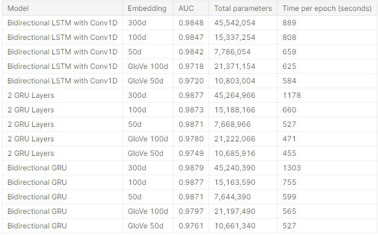

# toxic-comment-classification
Natural Language Processing modelling with dataset from https://www.kaggle.com/c/jigsaw-toxic-comment-classification-challenge

## Kaggle
[Toxic Comment Dataset from Kaggle](https://www.kaggle.com/c/jigsaw-toxic-comment-classification-challenge/data)
[Link to Kaggle notebook](https://www.kaggle.com/theoleung/toxic-comment-classification-with-glove-embeddings/notebook)

